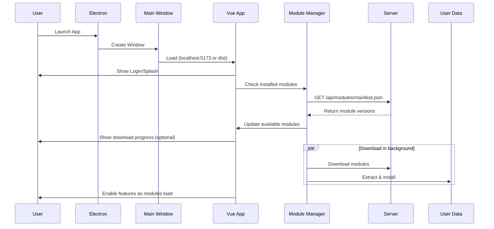

# Progressive Download Architecture - Electron Vibe App

> **Mục tiêu**: Thiết kế Electron admin dashboard (~2GB) với progressive download, cho phép người dùng tải Core App nhỏ gọn (~200MB) và sử dụng ngay, trong khi các module/assets nặng (~1.8GB) được tải ngầm sau đó.

---

## 1. Tổng Quan Kiến Trúc

### 1.1 Cấu Trúc Project Hiện Tại

```
electron-vibe-app/
├── src/                           # Electron Main Process
│   ├── main.ts                    # Entry point Electron
│   └── preload.ts                 # Preload script
├── vibe-app/                      # Vue.js Admin Dashboard
│   ├── src/
│   │   ├── App.vue
│   │   ├── main.ts
│   │   ├── @core/                 # Core components & utils
│   │   ├── @layouts/              # Layout system
│   │   ├── components/            # Shared components
│   │   ├── composables/           # Vue composables
│   │   ├── pages/                 # Route pages
│   │   │   ├── base-ui/
│   │   │   ├── lms/               # Learning Management
│   │   │   ├── nhms/              # Hospital Management
│   │   │   └── pms/               # Project Management
│   │   ├── plugins/               # Vue plugins
│   │   └── views/                 # Page views
│   └── dist/                      # Built Vue app
└── dist/                          # Built Electron app
```

### 1.2 Phân Tách Theo Progressive Download

```
Core App (~200MB)
├── Electron Main Process
│   ├── Window management
│   ├── IPC handlers
│   ├── Auto-updater
│   └── Module Manager ⭐ (NEW)
│
├── Vue.js Dashboard (Base)
│   ├── Authentication (login, register)
│   ├── Base layouts & navigation
│   ├── Core components (@core)
│   └── Loading indicators
│
└── Essential Assets
    ├── Fonts (roboto)
    ├── Core icons
    └── Base UI components

External Modules (~1.8GB)
├── modules/
│   ├── lms-module.zip             # Learning Management System
│   ├── nhms-module.zip            # Hospital Management System
│   ├── pms-module.zip             # Project Management System
│   └── base-ui-module.zip         # Extended UI components
├── assets/
│   ├── heavy-images/
│   ├── charts-data/
│   └── demo-content/
└── dependencies/
    ├── heavy-libs.zip             # Large third-party libs
    └── vendor-assets.zip
```

---

## 2. Luồng Hoạt Động (Runtime Flow)

### 2.1 App Startup Flow



### 2.2 Chi Tiết Các Bước

#### Bước 1: User Cài Core App

- Installer chỉ chứa:
  - Electron framework
  - Vue.js core app (authentication, layouts, @core)
  - Essential assets
- Dung lượng: ~200MB
- Thời gian cài: Nhanh (1-2 phút)

#### Bước 2: User Mở App

- App khởi động và load Vue dev server (dev) hoặc dist (production)
- Hiển thị:
  - Login page ([login.vue](vibe-app/src/pages/login.vue))
  - Loading indicator ([AppLoadingIndicator.vue](vibe-app/src/components/AppLoadingIndicator.vue))
  - Splash screen (optional)

#### Bước 3: Kiểm Tra Modules

- Module Manager (Electron main process) gọi API:
  ```
  GET https://your-server.com/api/modules/manifest.json
  ```
- So sánh với `manifest.json` local trong `userData`

#### Bước 4: Tải Modules Ngầm

- Download `.zip` files vào temporary folder
- Hiển thị progress qua IPC → Vue component
- Features:
  - Resume download (HTTP Range header)
  - Retry on failure
  - Pause/Cancel (optional)

#### Bước 5: Extract & Load Modules

- Giải nén vào `userData/modules/`
- Update routes dynamically
- Load components on-demand

---

## 3. Implementation Guide

### 3.1 Electron Main Process - Module Manager

**Tạo file mới**: `src/modules/ModuleManager.ts`

```typescript
import { app, ipcMain } from "electron";
import * as path from "path";
import * as fs from "fs";
import https from "https";
import AdmZip from "adm-zip";

export interface ModuleManifest {
  modules: {
    [key: string]: {
      version: string;
      url: string;
      size: number;
      checksum: string;
    };
  };
}

export class ModuleManager {
  private userDataPath: string;
  private modulesPath: string;
  private manifestPath: string;

  constructor() {
    this.userDataPath = app.getPath("userData");
    this.modulesPath = path.join(this.userDataPath, "modules");
    this.manifestPath = path.join(this.userDataPath, "manifest.json");

    this.ensureDirectories();
    this.setupIPC();
  }

  private ensureDirectories() {
    if (!fs.existsSync(this.modulesPath)) {
      fs.mkdirSync(this.modulesPath, { recursive: true });
    }
  }

  private setupIPC() {
    ipcMain.handle("modules:check-updates", async () => {
      return await this.checkForUpdates();
    });

    ipcMain.handle("modules:download", async (event, moduleName: string) => {
      return await this.downloadModule(moduleName, (progress) => {
        event.sender.send("modules:download-progress", {
          moduleName,
          progress,
        });
      });
    });

    ipcMain.handle("modules:get-installed", async () => {
      return this.getInstalledModules();
    });
  }

  async checkForUpdates(): Promise<ModuleManifest> {
    const serverManifest = await this.fetchServerManifest();
    const localManifest = this.getLocalManifest();

    // Compare versions and return updates needed
    return serverManifest;
  }

  private async fetchServerManifest(): Promise<ModuleManifest> {
    const manifestUrl = "https://your-server.com/api/modules/manifest.json";

    return new Promise((resolve, reject) => {
      https
        .get(manifestUrl, (res) => {
          let data = "";
          res.on("data", (chunk) => (data += chunk));
          res.on("end", () => resolve(JSON.parse(data)));
        })
        .on("error", reject);
    });
  }

  private getLocalManifest(): ModuleManifest {
    if (fs.existsSync(this.manifestPath)) {
      return JSON.parse(fs.readFileSync(this.manifestPath, "utf-8"));
    }
    return { modules: {} };
  }

  async downloadModule(
    moduleName: string,
    onProgress: (progress: number) => void
  ): Promise<boolean> {
    const manifest = await this.fetchServerManifest();
    const moduleInfo = manifest.modules[moduleName];

    if (!moduleInfo) {
      throw new Error(`Module ${moduleName} not found`);
    }

    const tempPath = path.join(this.userDataPath, "temp", `${moduleName}.zip`);
    const modulePath = path.join(this.modulesPath, moduleName);

    // Download
    await this.downloadFile(moduleInfo.url, tempPath, onProgress);

    // Verify checksum
    const isValid = await this.verifyChecksum(tempPath, moduleInfo.checksum);
    if (!isValid) {
      fs.unlinkSync(tempPath);
      throw new Error("Checksum verification failed");
    }

    // Extract
    const zip = new AdmZip(tempPath);
    zip.extractAllTo(modulePath, true);

    // Cleanup
    fs.unlinkSync(tempPath);

    // Update local manifest
    this.updateLocalManifest(moduleName, moduleInfo.version);

    return true;
  }

  private downloadFile(
    url: string,
    dest: string,
    onProgress: (progress: number) => void
  ): Promise<void> {
    return new Promise((resolve, reject) => {
      const dir = path.dirname(dest);
      if (!fs.existsSync(dir)) {
        fs.mkdirSync(dir, { recursive: true });
      }

      const file = fs.createWriteStream(dest);

      https
        .get(url, (res) => {
          const total = Number(res.headers["content-length"]);
          let downloaded = 0;

          res.on("data", (chunk) => {
            downloaded += chunk.length;
            onProgress(downloaded / total);
          });

          res.pipe(file);

          file.on("finish", () => {
            file.close();
            resolve();
          });
        })
        .on("error", (err) => {
          fs.unlinkSync(dest);
          reject(err);
        });
    });
  }

  private async verifyChecksum(
    filePath: string,
    expectedChecksum: string
  ): Promise<boolean> {
    const crypto = require("crypto");
    const hash = crypto.createHash("sha256");
    const fileBuffer = fs.readFileSync(filePath);
    hash.update(fileBuffer);
    const fileChecksum = hash.digest("hex");
    return fileChecksum === expectedChecksum;
  }

  private updateLocalManifest(moduleName: string, version: string) {
    const manifest = this.getLocalManifest();
    if (!manifest.modules[moduleName]) {
      manifest.modules[moduleName] = {
        version,
        url: "",
        size: 0,
        checksum: "",
      };
    }
    manifest.modules[moduleName].version = version;
    fs.writeFileSync(this.manifestPath, JSON.stringify(manifest, null, 2));
  }

  getInstalledModules(): string[] {
    const manifest = this.getLocalManifest();
    return Object.keys(manifest.modules);
  }

  getModulePath(moduleName: string): string {
    return path.join(this.modulesPath, moduleName);
  }
}
```

### 3.2 Update `src/main.ts`

```typescript
import { app, BrowserWindow } from "electron";
import * as path from "path";
import { ModuleManager } from "./modules/ModuleManager";

let mainWindow: BrowserWindow | null = null;
let moduleManager: ModuleManager;

function createWindow() {
  mainWindow = new BrowserWindow({
    width: 1200,
    height: 800,
    webPreferences: {
      preload: path.join(__dirname, "preload.js"),
      nodeIntegration: false,
      contextIsolation: true,
      sandbox: false,
    },
  });

  // Initialize Module Manager
  moduleManager = new ModuleManager();

  if (process.env.NODE_ENV === "development") {
    mainWindow.loadURL("http://localhost:5173");
  } else {
    const indexPath = path.join(__dirname, "../vibe-app/dist/index.html");
    mainWindow.loadFile(indexPath);
  }

  if (process.env.NODE_ENV === "development") {
    mainWindow.webContents.openDevTools();
  }

  mainWindow.on("closed", () => {
    mainWindow = null;
  });
}

app.whenReady().then(createWindow);

app.on("window-all-closed", () => {
  if (process.platform !== "darwin") app.quit();
});

app.on("activate", () => {
  if (BrowserWindow.getAllWindows().length === 0) createWindow();
});
```

### 3.3 Vue.js - Module Composable

**Tạo file**: `vibe-app/src/composables/useModules.ts`

```typescript
import { ref, onMounted } from "vue";

interface Module {
  name: string;
  version: string;
  installed: boolean;
  downloading: boolean;
  progress: number;
}

export function useModules() {
  const modules = ref<Record<string, Module>>({});
  const isLoading = ref(false);

  const checkForUpdates = async () => {
    isLoading.value = true;
    try {
      const manifest = await window.electronAPI.checkModuleUpdates();
      const installed = await window.electronAPI.getInstalledModules();

      // Update modules state
      for (const [name, info] of Object.entries(manifest.modules)) {
        modules.value[name] = {
          name,
          version: info.version,
          installed: installed.includes(name),
          downloading: false,
          progress: 0,
        };
      }
    } finally {
      isLoading.value = false;
    }
  };

  const downloadModule = async (moduleName: string) => {
    if (!modules.value[moduleName]) return;

    modules.value[moduleName].downloading = true;

    try {
      await window.electronAPI.downloadModule(moduleName);
      modules.value[moduleName].installed = true;
    } catch (error) {
      console.error(`Failed to download ${moduleName}:`, error);
    } finally {
      modules.value[moduleName].downloading = false;
    }
  };

  // Listen for download progress
  window.electronAPI.onDownloadProgress((data: any) => {
    if (modules.value[data.moduleName]) {
      modules.value[data.moduleName].progress = data.progress;
    }
  });

  onMounted(() => {
    checkForUpdates();
  });

  return {
    modules,
    isLoading,
    checkForUpdates,
    downloadModule,
  };
}
```

### 3.4 Preload Script Types

**Update**: `vibe-app/src/electron.d.ts`

```typescript
export interface IElectronAPI {
  checkModuleUpdates: () => Promise<any>;
  getInstalledModules: () => Promise<string[]>;
  downloadModule: (moduleName: string) => Promise<boolean>;
  onDownloadProgress: (
    callback: (data: { moduleName: string; progress: number }) => void
  ) => void;
}

declare global {
  interface Window {
    electronAPI: IElectronAPI;
  }
}
```

### 3.5 Update Preload Script

**Update**: `src/preload.ts`

```typescript
import { contextBridge, ipcRenderer } from "electron";

contextBridge.exposeInMainWorld("electronAPI", {
  checkModuleUpdates: () => ipcRenderer.invoke("modules:check-updates"),
  getInstalledModules: () => ipcRenderer.invoke("modules:get-installed"),
  downloadModule: (moduleName: string) =>
    ipcRenderer.invoke("modules:download", moduleName),
  onDownloadProgress: (callback: (data: any) => void) => {
    ipcRenderer.on("modules:download-progress", (_, data) => callback(data));
  },
});
```

### 3.6 Vue Component - Module Manager UI

**Tạo file**: `vibe-app/src/components/ModuleManager.vue`

```vue
<template>
  <VCard>
    <VCardTitle>Module Manager</VCardTitle>
    <VCardText>
      <VRow v-if="isLoading">
        <VCol cols="12" class="text-center">
          <VProgressCircular indeterminate color="primary" />
          <p class="mt-4">Checking for modules...</p>
        </VCol>
      </VRow>

      <VRow v-else>
        <VCol v-for="module in modules" :key="module.name" cols="12" md="6">
          <VCard variant="outlined">
            <VCardText>
              <div class="d-flex justify-space-between align-center mb-2">
                <h3>{{ formatModuleName(module.name) }}</h3>
                <VChip
                  :color="module.installed ? 'success' : 'warning'"
                  size="small"
                >
                  {{ module.installed ? "Installed" : "Not Installed" }}
                </VChip>
              </div>

              <p class="text-caption mb-2">Version: {{ module.version }}</p>

              <VProgressLinear
                v-if="module.downloading"
                :model-value="module.progress * 100"
                color="primary"
                height="8"
                class="mb-2"
              />

              <VBtn
                v-if="!module.installed && !module.downloading"
                color="primary"
                size="small"
                @click="downloadModule(module.name)"
              >
                Download
              </VBtn>

              <VBtn
                v-if="module.downloading"
                color="warning"
                size="small"
                disabled
              >
                Downloading... {{ Math.round(module.progress * 100) }}%
              </VBtn>

              <VBtn
                v-if="module.installed"
                color="success"
                size="small"
                disabled
              >
                Installed
              </VBtn>
            </VCardText>
          </VCard>
        </VCol>
      </VRow>
    </VCardText>
  </VCard>
</template>

<script setup lang="ts">
import { useModules } from "@/composables/useModules";

const { modules, isLoading, downloadModule } = useModules();

const formatModuleName = (name: string): string => {
  return name
    .split("-")
    .map((word) => word.charAt(0).toUpperCase() + word.slice(1))
    .join(" ");
};
</script>
```

---

## 4. Dynamic Route Loading

### 4.1 Route Configuration với Lazy Loading

**Update**: `vibe-app/src/plugins/1.router/index.ts`

```typescript
import { createRouter, createWebHistory } from "vue-router";
import { ipcRenderer } from "electron";

const router = createRouter({
  history: createWebHistory(import.meta.env.BASE_URL),
  routes: [
    // Core routes (always available)
    {
      path: "/login",
      component: () => import("@/pages/login.vue"),
    },
    {
      path: "/",
      component: () => import("@/layouts/default.vue"),
      children: [
        // Base UI (conditionally loaded)
        {
          path: "base-ui",
          component: () =>
            loadModuleComponent("base-ui-module", "pages/base-ui/index.vue"),
          meta: { requiresModule: "base-ui-module" },
        },
        // LMS (conditionally loaded)
        {
          path: "lms",
          component: () =>
            loadModuleComponent("lms-module", "pages/lms/index.vue"),
          meta: { requiresModule: "lms-module" },
        },
        // NHMS (conditionally loaded)
        {
          path: "nhms",
          component: () =>
            loadModuleComponent("nhms-module", "pages/nhms/index.vue"),
          meta: { requiresModule: "nhms-module" },
        },
        // PMS (conditionally loaded)
        {
          path: "pms",
          component: () =>
            loadModuleComponent("pms-module", "pages/pms/index.vue"),
          meta: { requiresModule: "pms-module" },
        },
      ],
    },
  ],
});

async function loadModuleComponent(moduleName: string, componentPath: string) {
  const installedModules = await window.electronAPI.getInstalledModules();

  if (!installedModules.includes(moduleName)) {
    // Return a placeholder component
    return () => import("@/components/ModulePlaceholder.vue");
  }

  // Load component from external module
  // This requires the module to be properly extracted
  const modulePath = `modules/${moduleName}/${componentPath}`;
  return () => import(/* @vite-ignore */ modulePath);
}

router.beforeEach(async (to, from, next) => {
  if (to.meta.requiresModule) {
    const installedModules = await window.electronAPI.getInstalledModules();

    if (!installedModules.includes(to.meta.requiresModule as string)) {
      // Redirect to module download page
      next({ name: "module-manager" });
      return;
    }
  }

  next();
});

export default router;
```

### 4.2 Module Placeholder Component

**Tạo file**: `vibe-app/src/components/ModulePlaceholder.vue`

```vue
<template>
  <VContainer>
    <VCard class="text-center pa-10">
      <VIcon icon="mdi-package-down" size="64" color="warning" class="mb-4" />
      <h2 class="mb-4">Module Not Installed</h2>
      <p class="mb-6">
        This module is not yet installed. Please download it to access this
        feature.
      </p>
      <VBtn color="primary" to="/module-manager"> Go to Module Manager </VBtn>
    </VCard>
  </VContainer>
</template>
```

---

## 5. Server-Side Setup

### 5.1 Manifest API Structure

**File**: `manifest.json` (hosted on your server)

```json
{
  "version": "1.0.0",
  "modules": {
    "lms-module": {
      "version": "2.1.0",
      "url": "https://cdn.your-server.com/modules/lms-module-2.1.0.zip",
      "size": 450000000,
      "checksum": "a3b2c1d4e5f6g7h8i9j0k1l2m3n4o5p6q7r8s9t0u1v2w3x4y5z6"
    },
    "nhms-module": {
      "version": "1.5.2",
      "url": "https://cdn.your-server.com/modules/nhms-module-1.5.2.zip",
      "size": 520000000,
      "checksum": "b4c5d6e7f8g9h0i1j2k3l4m5n6o7p8q9r0s1t2u3v4w5x6y7z8a9"
    },
    "pms-module": {
      "version": "3.0.1",
      "url": "https://cdn.your-server.com/modules/pms-module-3.0.1.zip",
      "size": 380000000,
      "checksum": "c5d6e7f8g9h0i1j2k3l4m5n6o7p8q9r0s1t2u3v4w5x6y7z8a9b0"
    },
    "base-ui-module": {
      "version": "1.2.0",
      "url": "https://cdn.your-server.com/modules/base-ui-module-1.2.0.zip",
      "size": 280000000,
      "checksum": "d6e7f8g9h0i1j2k3l4m5n6o7p8q9r0s1t2u3v4w5x6y7z8a9b0c1"
    }
  }
}
```

### 5.2 Module Package Structure

Each module zip should contain:

```
lms-module-2.1.0.zip
├── pages/
│   └── lms/
│       ├── index.vue
│       ├── courses.vue
│       └── students.vue
├── views/
│   └── lms/
│       ├── CourseList.vue
│       └── StudentList.vue
├── components/
│   ├── CourseCard.vue
│   └── StudentCard.vue
├── assets/
│   ├── images/
│   └── styles/
└── package.json
```

---

## 6. Build Configuration

### 6.1 Update `package.json` Dependencies

```json
{
  "devDependencies": {
    "@types/node": "^20.19.28",
    "adm-zip": "^0.5.10",
    "@types/adm-zip": "^0.5.5",
    "concurrently": "^9.2.1",
    "electron": "^39.2.7",
    "electron-builder": "^26.4.0",
    "ts-node": "^10.9.2",
    "typescript": "^5.9.3",
    "wait-on": "^9.0.3"
  }
}
```

### 6.2 Exclude Modules from Build

Update `electron-builder` configuration in `package.json`:

```json
{
  "build": {
    "appId": "com.vibe.admin",
    "productName": "Vibe Admin Dashboard",
    "files": ["dist/**/*", "vibe-app/dist/**/*", "package.json"],
    "extraResources": [
      {
        "from": "vibe-app/dist",
        "to": "app",
        "filter": ["**/*"]
      }
    ],
    "asarUnpack": ["vibe-app/dist/**/*"],
    "directories": {
      "buildResources": "assets",
      "output": "release"
    },
    "mac": {
      "category": "public.app-category.productivity",
      "target": ["dmg", "zip"]
    },
    "win": {
      "target": ["nsis", "portable"]
    },
    "linux": {
      "target": ["AppImage", "deb"],
      "category": "Utility"
    }
  }
}
```

---

## 7. User Data Directory Structure

```
macOS: ~/Library/Application Support/Vibe Admin Dashboard/
Windows: %APPDATA%/Vibe Admin Dashboard/

Directory Structure:
Vibe Admin Dashboard/
├── modules/
│   ├── lms-module/
│   │   ├── pages/
│   │   ├── views/
│   │   └── components/
│   ├── nhms-module/
│   ├── pms-module/
│   └── base-ui-module/
├── cache/
│   └── downloads/
├── logs/
│   ├── main.log
│   └── renderer.log
├── manifest.json
└── config.json
```

---

## 8. Best Practices & Anti-Patterns

### ✅ DO

1. **Separate concerns**: Core app vs. external modules
2. **Use `app.getPath('userData')`** for all user data
3. **Verify checksums** after download
4. **Handle partial downloads** with resume capability
5. **Provide clear UX** - show progress, allow cancellation
6. **Version control** - support incremental updates
7. **Error handling** - retry logic, cleanup on failure
8. **Test offline mode** - app should work with cached modules

### ❌ DON'T

1. **Don't bundle heavy modules** in `dependencies` or `asar`
2. **Don't write to installation directory** (permission issues)
3. **Don't block main thread** during downloads
4. **Don't forget to cleanup** temporary files
5. **Don't skip checksum verification**
6. **Don't hardcode paths** - use Electron APIs
7. **Don't ignore errors** - always provide user feedback
8. **Don't force download** - let user choose when to download

---

## 9. Testing Checklist

- [ ] Core app launches without modules
- [ ] Module download with progress tracking
- [ ] Resume interrupted download
- [ ] Checksum verification works
- [ ] Module extraction successful
- [ ] Routes load after module install
- [ ] Placeholder shown for missing modules
- [ ] Multiple concurrent downloads
- [ ] Error handling (network failure, disk full)
- [ ] Module update detection
- [ ] Cleanup on uninstall
- [ ] Cross-platform compatibility (Windows, macOS, Linux)

---

## 10. Performance Considerations

### 10.1 Download Optimization

- Use CDN for module hosting
- Implement HTTP/2 for faster downloads
- Compress modules (gzip/brotli)
- Chunk large modules for better resume

### 10.2 Memory Management

- Stream file downloads (don't load into memory)
- Extract zip files in chunks
- Clear cache periodically
- Limit concurrent downloads (max 2-3)

### 10.3 Startup Time

- Don't check for updates on every startup
- Cache module manifest locally
- Lazy load routes
- Use web workers for heavy operations

---

## 11. Security Considerations

1. **HTTPS only** for downloads
2. **SHA-256 checksum** verification
3. **Code signing** for modules
4. **Sandbox execution** for untrusted code
5. **Content Security Policy** in renderer
6. **Validate manifest.json** structure
7. **Rate limiting** on download requests
8. **Secure storage** for API tokens

---

## 12. Future Enhancements

- [ ] P2P module sharing (BitTorrent-like)
- [ ] Delta updates (only download changed files)
- [ ] Background update service
- [ ] Module marketplace
- [ ] Analytics for module usage
- [ ] Rollback mechanism
- [ ] Module dependencies management
- [ ] Hot module replacement

---

## 13. References

### Similar Implementations

- **VS Code**: Extension marketplace
- **Slack**: App directory
- **Discord**: Plugin system
- **Notion**: Template gallery
- **Figma**: Plugin architecture

### Libraries Used

- **adm-zip**: ZIP file extraction
- **electron-updater**: Auto-update core app
- **ofetch**: HTTP client (Vue.js side)
- **pinia**: State management

---

## 14. Support & Maintenance

### Monitoring

- Track download success/failure rates
- Monitor module usage statistics
- Log errors to remote server
- User feedback mechanism

### Documentation

- Module development guide
- API documentation
- Troubleshooting guide
- Release notes for each module

---

**Last Updated**: January 14, 2026  
**App Version**: 1.0.0  
**Architecture Version**: 1.0

```

```
